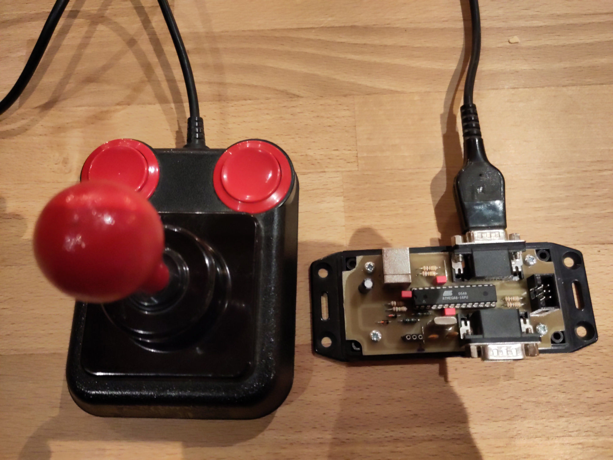
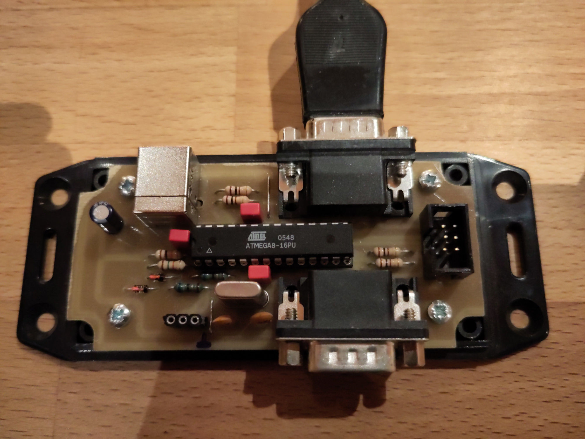

# c64-dual-joystick-usb

Adapter to connect C64 joysticks to a "modern" USB port

Just connect it to the PC over a USB 1.1 port and have two joystick ports available.

This c64-dual-joystick-usb HW and SW is licensed under the GNU General Public License Version 2 GPLv2.

## Hardware

The PCB has been designed using Kicad and it is located in the 'hw' folder. This is the schematic for this little device:
<a href="https://github.com/irqmask/c64-dual-joystick-usb/blob/main/hw/c64-dual-joystick-usb.pdf">'C64 Dual Joystick USB adapter Schematic'</a>

## Firmware

The firmware for the device along with some test-firmware is located in the 'sw' folder. Build instructions: <a href="https://github.com/irqmask/c64-dual-joystick-usb/blob/main/doc/build.md">'doc/build.md'</a>

This project makes use of the v-usb library which provides low-speed USB capability for AVR microcontrollers. 
https://www.obdev.at/vusb/

